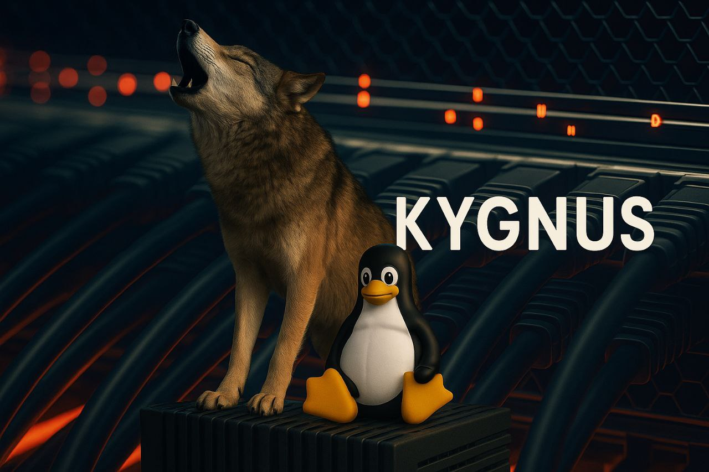

# myUTM - Enterprise-Grade Unified Threat Management Solution


**Open-Source Network Security Platform for Modern Enterprises**

## Table of Contents
- [Overview](#overview)
- [Key Features](#key-features)
- [Command Reference](#command-reference)
- [Installation](#installation)
- [Security Features](#security-features)
- [Troubleshooting](#troubleshooting)
- [License](#license)

## Overview

myUTM is a comprehensive open-source Unified Threat Management solution that transforms your Linux system into a powerful security appliance. The script combines multiple security tools with an easy-to-use command interface for enterprise-grade protection.

## Key Features

### Core Security Components
- **Multi-engine Antivirus Scanning**: ClamAV, Maldet, RKHunter, YARA
- **Intrusion Detection/Prevention**: Suricata with IPS capabilities
- **Firewall Management**: Port/service-based rules with panic mode
- **Threat Monitoring**: URL monitoring and alerting

### Operational Features
- **User Management**: Quota-based internet access control
- **Bandwidth Control**: Per-user bandwidth limits
- **VPN Management**: OpenVPN with client management
- **Web Filtering**: Domain and application blocking
- **Advanced Threat Protection**: Sandboxing and auto-blocking

## Command Reference

### Antivirus Scanning
```bash
--scan antivirus --clamav             # Run ClamAV scan
--scan antivirus --maldet             # Run Maldet scan
--scan antivirus --rkhunter           # Run RKHunter scan
--scan antivirus --yara               # Run YARA scan
--scan antivirus --full               # Full system scan (all scanners)
--scan antivirus --update             # Update all scanning databases
```

### Intrusion Detection/Prevention
```bash
--ids suricata --start                # Start Suricata IDS
--ids suricata --active-log           # Show active log
--ids suricata --update               # Update Suricata rules
--ids suricata --ips-mode             # Configure IPS mode
--ids suricata --add-rule "RULE"      # Add custom rule
--ids vulnerability --check           # Run vulnerability check
```

### Firewall Management
```bash
--firewall rule --add-port PORT --proto PROTO  # Add port rule
--firewall rule --add-service SERVICE          # Add service rule
--firewall panic --enable/--disable            # Toggle panic mode
```

### Threat Monitoring
```bash
--threads --add URL                   # Add URL to monitor
--threads --list                      # List monitored URLs
--threads --remove ID                 # Remove monitored URL
```

### User & Bandwidth Management
```bash
--users --add USERNAME QUOTA_MB EXPIRY_DATE  # Add user with quota
--users --list                      # List all users
--bandwidth --set USERNAME DOWN UP  # Set bandwidth limits (Kbps)
```

### VPN Management
```bash
--vpn --install                     # Install OpenVPN
--vpn --add-client NAME             # Generate client config
--vpn --list-clients                # List all VPN clients
```

### Web Filtering
```bash
--webfilter --enable                # Enable web filtering
--webfilter --add-rule --url (allow|block) DOMAIN  # Add URL rule
--webfilter --add-rule --app (allow|block) APP_NAME  # Add app rule
```

## Installation

### Requirements
- Linux system (Ubuntu/CentOS recommended)
- Root access
- Minimum 2GB RAM, 20GB disk space

### Quick Install
```bash
git clone https://github.com/KYGnus/myUTM.git
cd myUTM
chmod +x myutm
sudo ./myutm --help
```

## Security Features

| Protection Layer       | Tools/Techniques                          |
|------------------------|------------------------------------------|
| Malware Prevention     | ClamAV, Maldet, YARA, RKHunter           |
| Intrusion Prevention   | Suricata (IDS/IPS), custom rules         |
| Network Protection     | Firewall rules, PSAD for port scanning   |
| Access Control         | User quotas, VPN management              |
| Content Filtering      | Web filtering rules                      |

## Troubleshooting

Common issues:
- **Scan failures**: Ensure databases are updated (`--scan antivirus --update`)
- **Rule conflicts**: Check logs at `/var/log/suricata/suricata.log`
- **Performance issues**: Adjust scan schedules for high-load systems

## License

GNU GPLv3 - Free for personal and commercial use. Enterprise support available.


